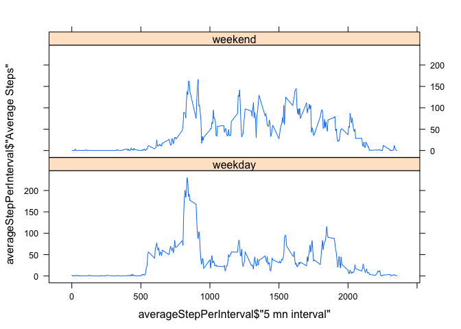

# Reproducible Research: Peer Assessment 1

## Loading and preprocessing the data
**1. Load the data**  
This code unzip activity.zip read the csv file obtained into a data frame named data.

```r
unzip('activity.zip')
data <- read.csv('activity.csv', stringsAsFactors=FALSE)
```
  
**2. Date field transformation**  
The date field is converted into Date objects.

```r
data$date <- as.Date(data$date, '%Y-%m-%d')
```
  
**3. Data structure**  
Thus data structure is:

```r
str(data)
```

```
## 'data.frame':	17568 obs. of  3 variables:
##  $ steps   : int  NA NA NA NA NA NA NA NA NA NA ...
##  $ date    : Date, format: "2012-10-01" "2012-10-01" ...
##  $ interval: int  0 5 10 15 20 25 30 35 40 45 ...
```

## What is mean total number of steps taken per day?
**1. Total number of steps taken per day** 

```r
totalStepPerDay  <- aggregate(data$steps,list(data$date),sum, na.rm=TRUE)
names(totalStepPerDay)  <- c('Day','Total Steps')
print(totalStepPerDay)
```

```
##           Day Total Steps
## 1  2012-10-01           0
## 2  2012-10-02         126
## 3  2012-10-03       11352
## 4  2012-10-04       12116
## 5  2012-10-05       13294
## 6  2012-10-06       15420
## 7  2012-10-07       11015
## 8  2012-10-08           0
## 9  2012-10-09       12811
## 10 2012-10-10        9900
## 11 2012-10-11       10304
## 12 2012-10-12       17382
## 13 2012-10-13       12426
## 14 2012-10-14       15098
## 15 2012-10-15       10139
## 16 2012-10-16       15084
## 17 2012-10-17       13452
## 18 2012-10-18       10056
## 19 2012-10-19       11829
## 20 2012-10-20       10395
## 21 2012-10-21        8821
## 22 2012-10-22       13460
## 23 2012-10-23        8918
## 24 2012-10-24        8355
## 25 2012-10-25        2492
## 26 2012-10-26        6778
## 27 2012-10-27       10119
## 28 2012-10-28       11458
## 29 2012-10-29        5018
## 30 2012-10-30        9819
## 31 2012-10-31       15414
## 32 2012-11-01           0
## 33 2012-11-02       10600
## 34 2012-11-03       10571
## 35 2012-11-04           0
## 36 2012-11-05       10439
## 37 2012-11-06        8334
## 38 2012-11-07       12883
## 39 2012-11-08        3219
## 40 2012-11-09           0
## 41 2012-11-10           0
## 42 2012-11-11       12608
## 43 2012-11-12       10765
## 44 2012-11-13        7336
## 45 2012-11-14           0
## 46 2012-11-15          41
## 47 2012-11-16        5441
## 48 2012-11-17       14339
## 49 2012-11-18       15110
## 50 2012-11-19        8841
## 51 2012-11-20        4472
## 52 2012-11-21       12787
## 53 2012-11-22       20427
## 54 2012-11-23       21194
## 55 2012-11-24       14478
## 56 2012-11-25       11834
## 57 2012-11-26       11162
## 58 2012-11-27       13646
## 59 2012-11-28       10183
## 60 2012-11-29        7047
## 61 2012-11-30           0
```
  
**2. Histogram of the total number of steps taken each day**  

```r
hist(totalStepPerDay$`Total Steps`, main = 'Histogram of the total number of steps\ntaken each day', xlab = 'Total number of steps', ylab = 'Frequency (Days)')
```

 
  
  
**3. Mean and median of the total number of steps taken per day**  
Mean

```r
mean(totalStepPerDay$`Total Steps`)
```

```
## [1] 9354.23
```
Median

```r
median(totalStepPerDay$`Total Steps`)
```

```
## [1] 10395
```

## What is the average daily activity pattern?
**1. time series plot of the 5-minute interval and the average number of steps taken, averaged across all days**  
5 mn interval are formated this way:  
- Two last digits: minutes in the hour  
- Preceding digits: Hour of the day  

```r
averageStepPerInterval  <- aggregate(data$steps,list(data$interval),mean, na.rm=TRUE)
names(averageStepPerInterval)  <- c('5 mn interval','Average Steps')
plot(averageStepPerInterval,type='l', main='Daily activity pattern')
```

 
  
**2. 5-minute interval, on average across all the days in the dataset, that contains the maximum number of steps**  
The 5 mn interval that has the maximum is:

```r
maxAverageStep <- max(averageStepPerInterval$'Average Steps')
interval <- averageStepPerInterval[averageStepPerInterval$`Average Steps`==maxAverageStep,]
print(interval$'5 mn interval')
```

```
## [1] 835
```
  

## Imputing missing values
**1. Total number of missing values in the dataset**  

```r
totalNumberNa <- nrow(subset(data,is.na(data$steps)))
print(totalNumberNa)
```

```
## [1] 2304
```
  
**2. Strategy to Fill in all of the missing values in the dataset**  
I will replace the missing value of an 5 man interval with the mean for that 5-minute interval averaged across all days.  

**3. New dataset that is equal to the original dataset but with the missing data filled in**  
I add a column that hold the 5-minute interval averaged across all days usgin merge function. Reordering is needed to have the rows in an chronological order.  

```r
dataNaFilled <- merge(x=data,y=averageStepPerInterval, by.x='interval', by.y='5 mn interval')
correctOrder <- order(dataNaFilled$date,dataNaFilled$interval)
dataNaFilled <- dataNaFilled[correctOrder,]
```

Then NA are replaced with the avarage and the extra column removed.

```r
nas  <- is.na(dataNaFilled$steps)
dataNaFilled[nas,]$steps <- dataNaFilled[nas,]$`Average Steps`
dataNaFilled <- subset(dataNaFilled, select=names(data))
```
  
**4. Histogram of the total number of steps taken each day and mean and median total number of steps taken per day**

Histogram of the total number of steps taken each day (same code than previously but using dataNaFilled rather than data)

```r
totalStepPerDay  <- aggregate(dataNaFilled$steps,list(dataNaFilled$date),sum)
names(totalStepPerDay)  <- c('Day','Total Steps')
hist(totalStepPerDay$`Total Steps`, main = 'Histogram of the total number of steps\ntaken each day', xlab = 'Total number of steps', ylab = 'Frequency (Days)')
```

 
  
Mean (same code than previously)  

```r
mean(totalStepPerDay$`Total Steps`)
```

```
## [1] 10766.19
```
  
Median (same code than previously)

```r
median(totalStepPerDay$`Total Steps`)
```

```
## [1] 10766.19
```
  
- Do these values differ from the estimates from the first part of the assignment?  
Yes these values differ from thes estimates from the first part of the assigment. The histogramm is more closer to a normal distribution. This impact the mean witch is bigger than the previous one (9354.23 -> 10766.19). And it impact also the median whitch is also bigger (10395 -> 10766.19). Mean an median are know equal (well it might be accidental).
- What is the impact of imputing missing data on the estimates of the total daily number of steps?  
The impact is quite important. It seams that it is better to replace missing data than to ignore them.  

## Are there differences in activity patterns between weekdays and weekends?

**1. Create a new factor variable in the dataset with two levels – “weekday” and “weekend”**  

```r
Sys.setlocale("LC_TIME", "en_US")
```

```
## [1] "en_US"
```

```r
dataNaFilled$daytype=NA
weekend <- weekdays(dataNaFilled$date,abbreviate=T) %in% c('Sat','Sun')
dataNaFilled$daytype[weekend] <- 'weekend'
dataNaFilled$daytype[!weekend] <- 'weekday'
dataNaFilled$daytype <- as.factor(dataNaFilled$daytype)
```
  
**2. Time series plot of the 5-minute interval and the average number of steps taken, averaged across all weekday days or weekend days**


```r
averageStepPerInterval  <- aggregate(dataNaFilled$steps,list(dataNaFilled$interval,dataNaFilled$daytype),mean, na.rm=TRUE)
names(averageStepPerInterval)  <- c('5 mn interval','Day type','Average Steps')
library(lattice)
xyplot(averageStepPerInterval$'Average Steps' ~ averageStepPerInterval$'5 mn interval' | averageStepPerInterval$'Day type',layout = c(1,2) , type = 'l')
```

 

